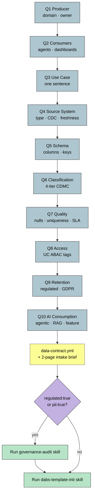

# 10Q Discovery Flow

> The 10-question intake interview that turns a fuzzy "we need this data" request into a deployable contract.

**Source IP:** `ip/authored/10q-framework.md` · `ip/authored/10q-toolkit/`. **Skill:** `data-source-10q-intake`.
