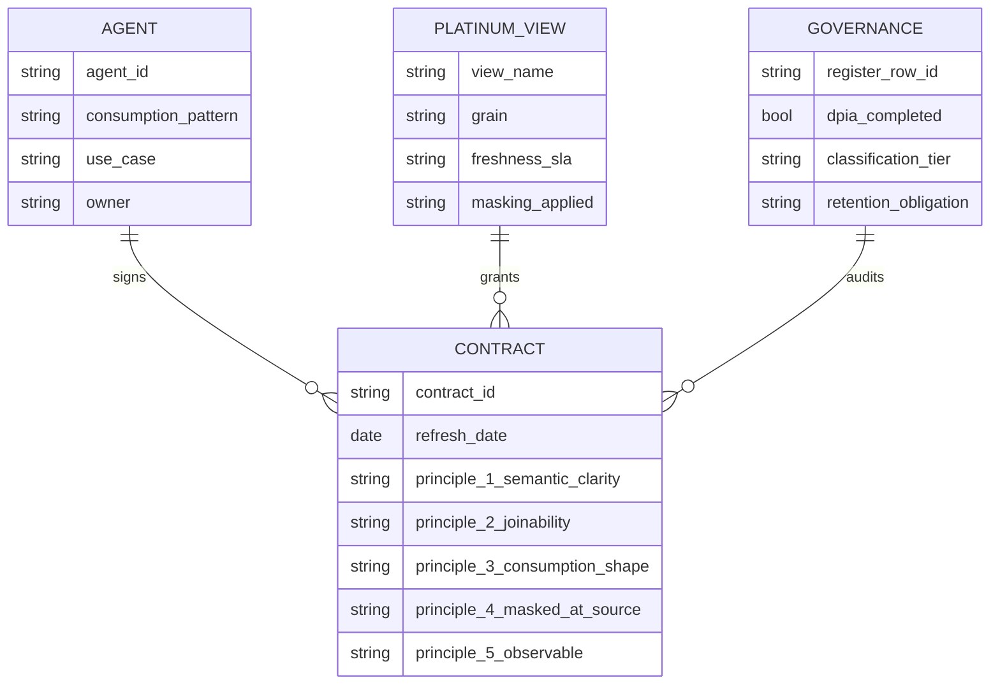

# AI Consumption Contract — Shape

> What an AI Consumption Contract looks like in practice. ER-style: agent ↔ Platinum view ↔ governance.

**Source IP:** `ip/authored/ai-ready-platinum-layer.md` · `data-products/ai-consumption-contract-template.md`. **Skill:** `ai-consumption-contract`.
