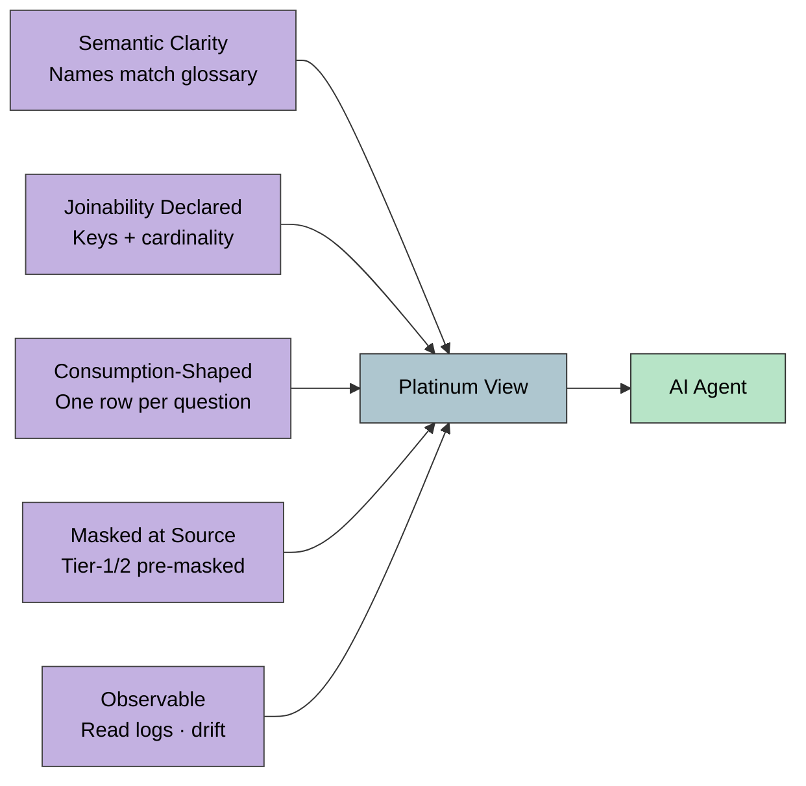
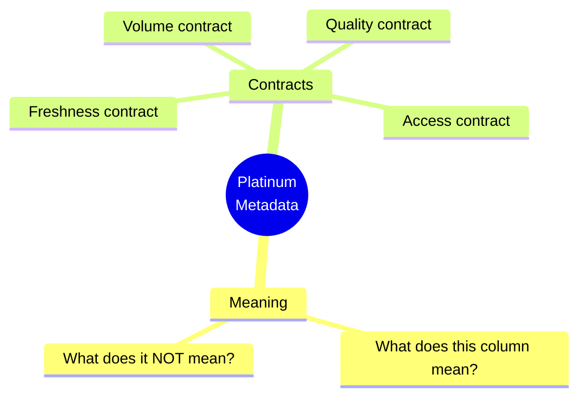

# AI-Ready Platinum — 5 Principles + 6-Question Rubric

> *1× publish → 1× govern → 5+ consume.* The Platinum layer as the runtime semantic layer for AI agents.

## 6-Question Metadata Rubric

**Source IP:** `ip/authored/ai-ready-platinum-layer.md`. **Curated underpinning:** Tekiner Context Wall · Bain 3-Layer Agentic.
