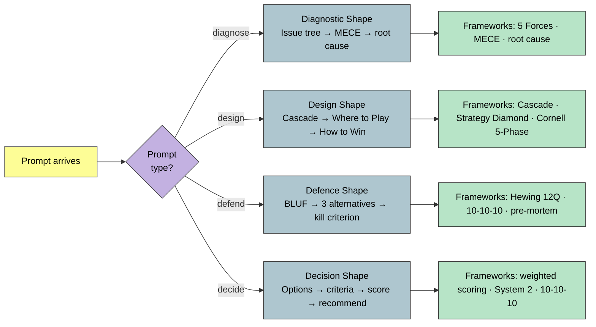

# Case Answer Shapes

> Four prompt types → framework combos. Pick the shape before picking the frameworks.

**Source IP:** `Knowledge/Strategy/case-answer-shapes.md`. **Pairs with:** `practice-context/voice-and-style.md`.
