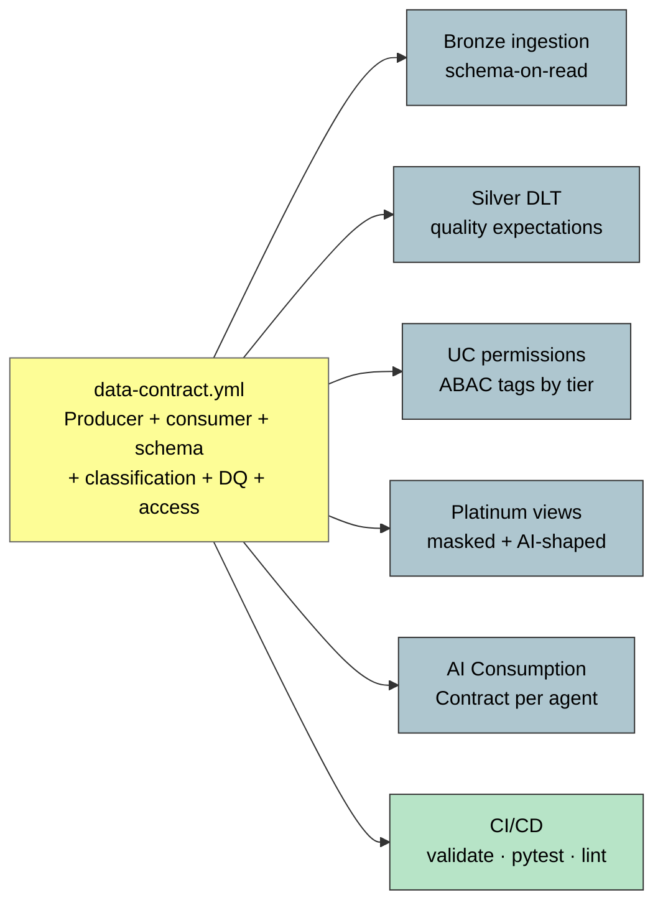

# DABs Data-Contract Golden Path — Contract Flow

> One `data-contract.yml` → Bronze ingestion + Silver DLT + UC ABAC + Platinum views + CI/CD. The mechanical bottom of contract-first data engineering.

**Time to deployable dev product:** under 30 minutes given a complete contract.
**Source IP:** `ip/authored/dabs-data-contract-golden-path.md` · `templates/dabs-data-product-template/`.
**Curated:** Data Contracts Producer-Consumer · Mahboub Metadata-Driven Ingestion · DABs CI/CD.
