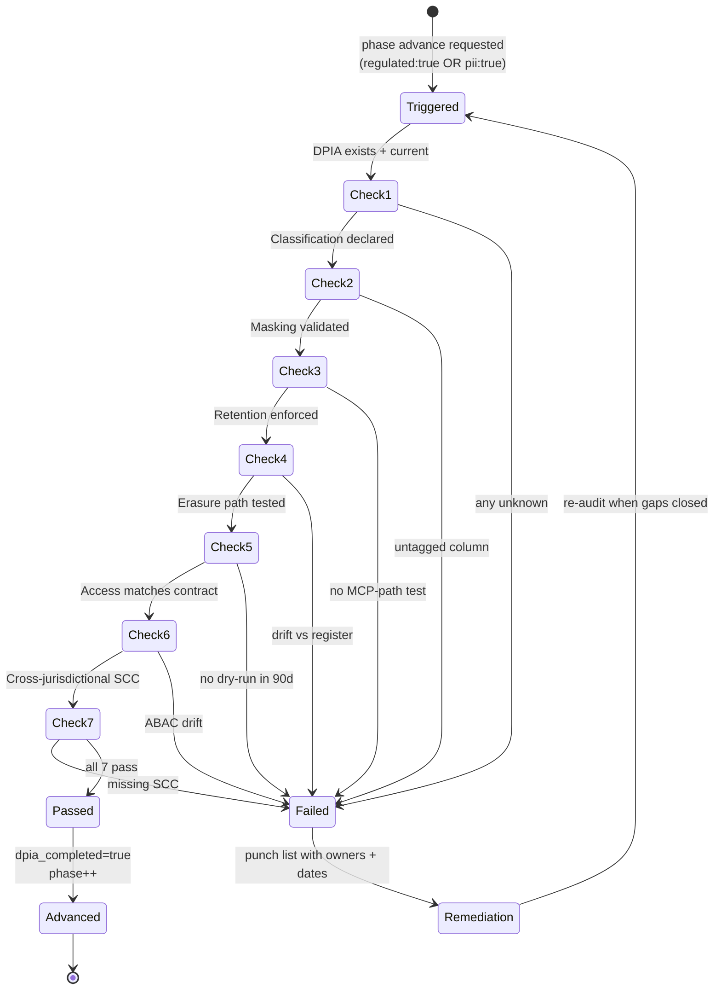

# Governance Audit Flow — Invariant #2

> Phase advance is blocked unless the 7-check audit passes. State diagram of the gate.

**Source IP:** Skill `governance-audit` (`.claude/skills/governance-audit/SKILL.md`). **Pairs with:** `governance/compliance-register.yaml` · `_Logs/sanitization-audit.md`.
