# IP Catalog — Honest Attribution

> Authored vs Curated vs EMBA. Invariant #3: never blurred.

```mermaid
flowchart LR
    subgraph AUTH[Authored — Paroz Mehta]
        A1[No LAC Principle]
        A2[AI-Ready Platinum]
        A3[10Q Framework]
        A4[Enterprise CLAUDE.md]
        A5[Platform-Mandate Playbook]
        A6[DABs Golden Path]
    end

    subgraph CUR[Curated — 12 named authors]
        C1[Mahboub · Metadata-Driven Ingestion]
        C2[Grover · Hewing · Tekiner]
        C3[Czarnas · Baeyens · Bain]
        C4[Kocyigit · Shi ×2]
        C5[Dataplex 6 Principles]
        C6[CDO Top 10]
    end

    subgraph EMBA[EMBA + Strategy]
        E1[Cornell-Queen's CA26]
        E2[Strategy Diamond · Kotter · Cascade]
    end

    AUTH -.cite separately.-> CUR
    EMBA -.grounding.-> AUTH

    classDef authored fill:#FDFD96,stroke:#666,color:#000
    classDef curated fill:#AEC6CF,stroke:#333,color:#000
    classDef emba fill:#C3B1E1,stroke:#444,color:#000

    class A1,A2,A3,A4,A5,A6 authored
    class C1,C2,C3,C4,C5,C6 curated
    class E1,E2 emba
```

**Rule:** every curated file carries a Source callout. Authored files state the original argument. Citation collisions are caught by `methodology/attribution-policy.md` lint.
