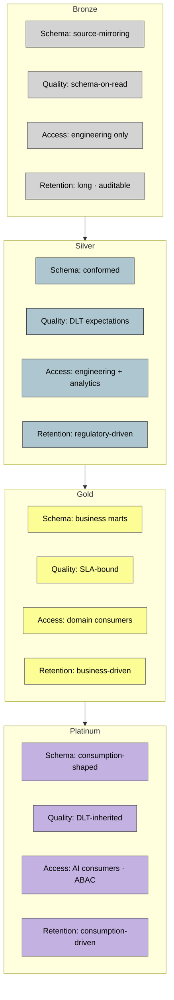

# Medallion Layers — Property Table

> One row per layer. Property differences are deliberate, not historical accident.

**Rule:** if a layer cannot answer all four properties, it does not exist yet — it is aspirational.

**Source IP:** `ip/authored/no-lac-principle.md` · `ip/authored/ai-ready-platinum-layer.md`.
