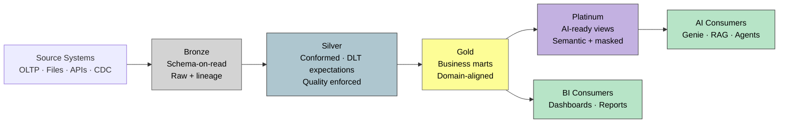

# No LAC Architecture — Bronze → Platinum

> *Land it once. Land it well. Get out of the business's way.* The medallion stack as a single platform, contract-driven.

**Source IP:** `ip/authored/no-lac-principle.md`. **Curated underpinning:** Shi 5 Pillars · Mahboub Metadata-Driven Ingestion.
