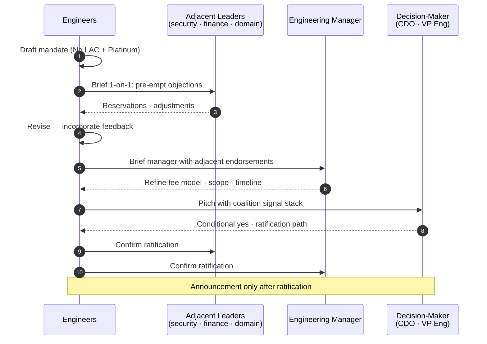

# Platform-Mandate Coalition Sequence

> How a platform formalization gets ratified. Engineers → adjacent leaders → manager → decision-maker. Coalition before announcement.

**Source IP:** `ip/authored/platform-mandate-playbook.md`.
**Pairs with:** `Workflows/executive-briefing.md` · `Workflows/negotiation-prep.md`.
