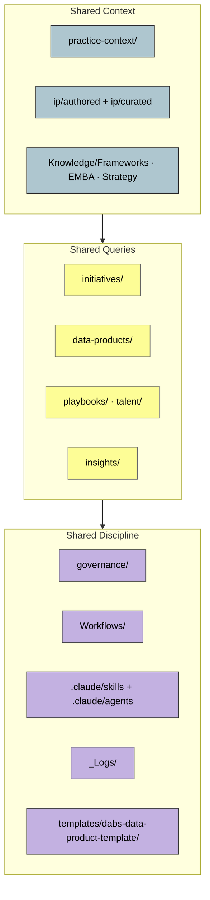

# Practice OS — Three-Layer Mental Model

> Noosphere's organizing model. Routing in CLAUDE.md follows these three layers.

```mermaid
flowchart TB
    subgraph L1[Shared Context]
        PC[practice-context/]
        IP[ip/authored + ip/curated]
        KN[Knowledge/Frameworks · EMBA · Strategy]
    end

    subgraph L2[Shared Queries]
        IN[initiatives/]
        DP[data-products/]
        PB[playbooks/ · talent/]
        IS[insights/]
    end

    subgraph L3[Shared Discipline]
        GV[governance/]
        WF[Workflows/]
        SK[.claude/skills + .claude/agents]
        LG[_Logs/]
        DABS[templates/dabs-data-product-template/]
    end

    L1 --> L2 --> L3

    classDef l1 fill:#AEC6CF,stroke:#333,color:#000
    classDef l2 fill:#FDFD96,stroke:#666,color:#000
    classDef l3 fill:#C3B1E1,stroke:#444,color:#000

    class PC,IP,KN l1
    class IN,DP,PB,IS l2
    class GV,WF,SK,LG,DABS l3
```

**Source IP:** `CLAUDE.md` (root) · `methodology/how-we-work.md`.
