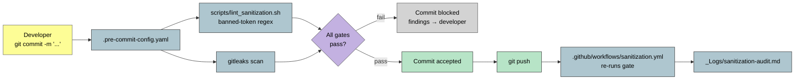

# Sanitization Flow — Invariant #0

> The pre-commit gate that keeps employer / team / stakeholder / JIRA / vendor / workspace IDs out of every commit.

**Source IP:** `Workflows/sanitization-pass.md` · `scripts/lint_sanitization.sh` · `_Logs/sanitization-audit.md`.
