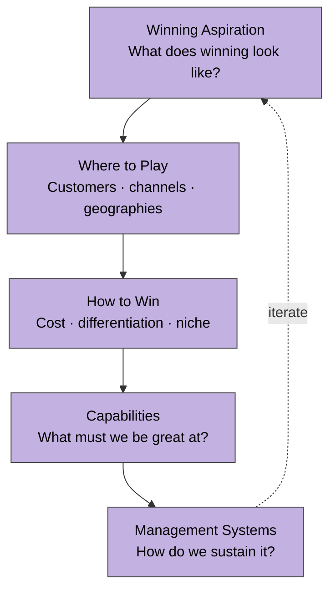

# Roger Martin Strategy Cascade

> Five integrated questions. Strategy is a coherent set of choices, not a list of priorities.

**Test of coherence:** any two answers should reinforce each other. If they conflict, the strategy is not yet integrated.

**Source IP:** `Knowledge/Strategy/roger-martin-cascade.md`. Curated.
